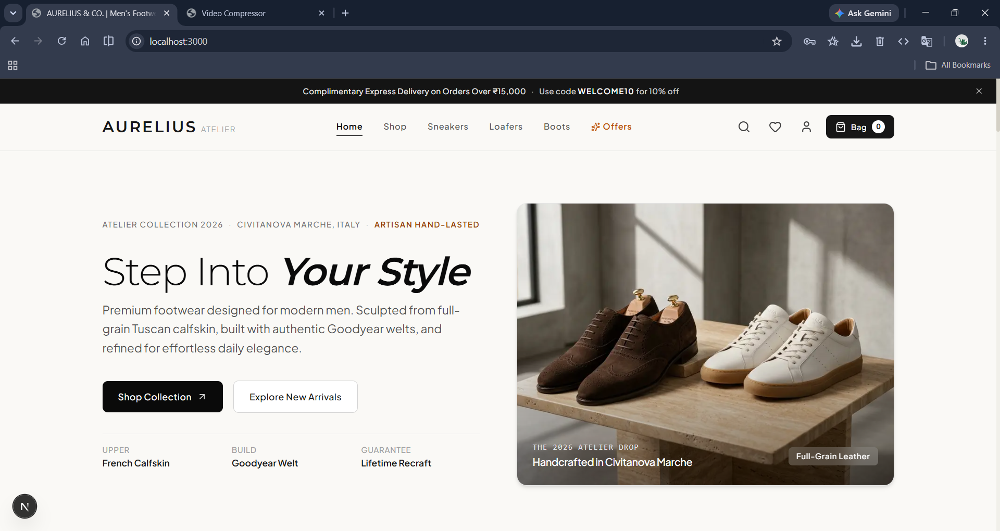
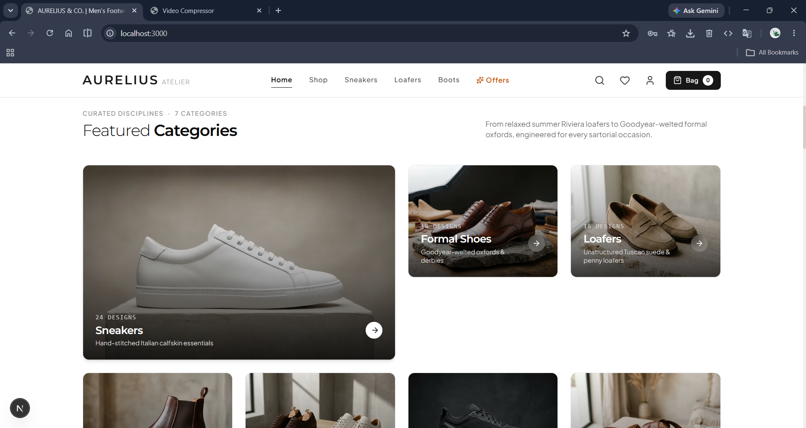
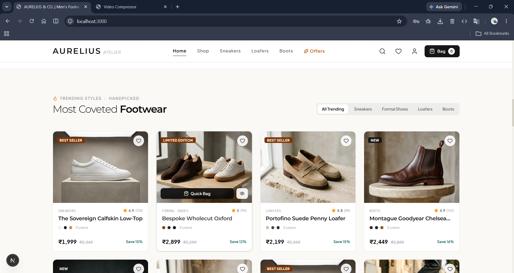
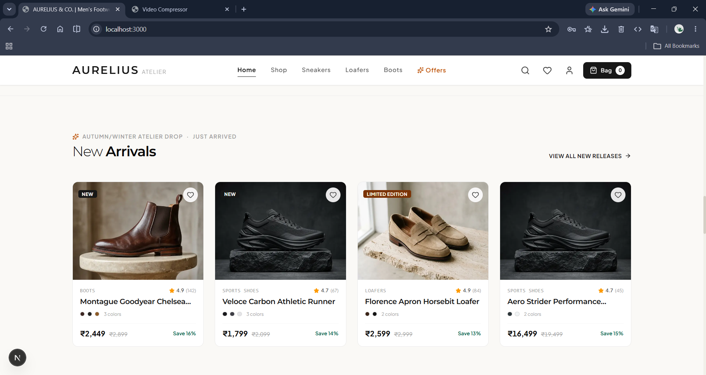
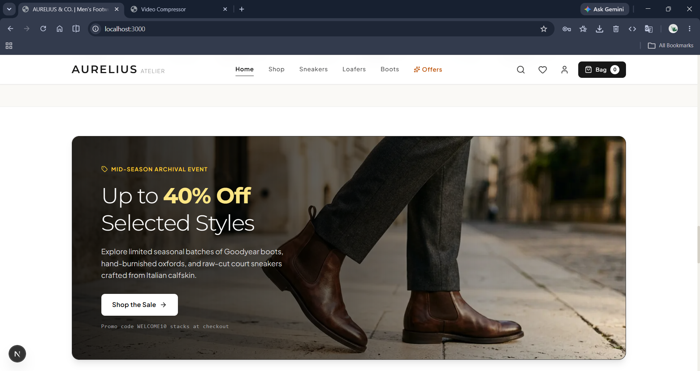
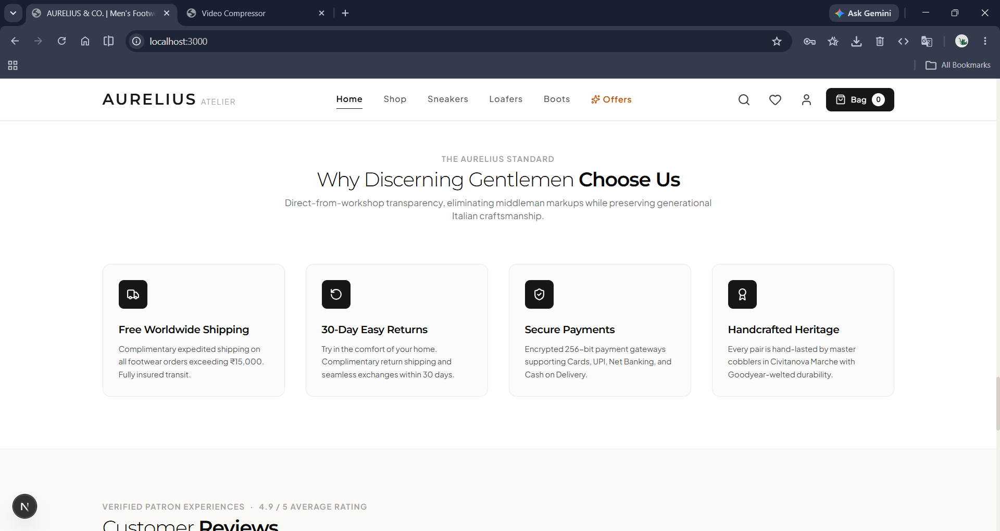
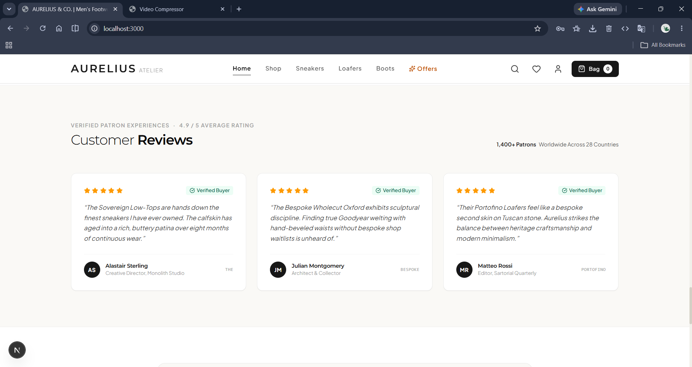
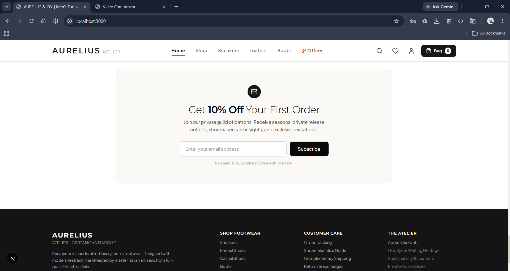
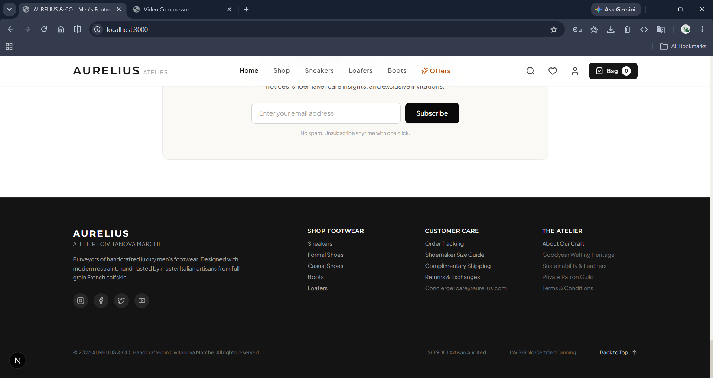

# AURELIUS & CO. | Men's Footwear

A premium e-commerce storefront for luxury men's footwear, built with Next.js and React. The project showcases handcrafted sneakers, formal oxfords, suede loafers, Chelsea boots, and other premium styles with a modern editorial shopping experience.

## Overview

This application presents a polished digital storefront for a menswear brand focused on craftsmanship, premium materials, and elevated product storytelling. It includes:

- Luxury landing page and hero experience
- Product catalog with category browsing
- Product cards with ratings, pricing, and badges
- Quick view and detailed product pages
- Shopping cart and wishlist flows
- Checkout experience
- Search modal and responsive navigation
- Animated UI with a premium aesthetic

## Preview










## Demo
[▶️Demo](assets/footwear.mp4)

## Tech Stack

- Next.js 15
- React 19
- TypeScript
- Tailwind CSS
- Lucide React icons
- Framer Motion (motion)
- ESLint

## Project Structure

```text
.
├── app/
│   ├── globals.css
│   ├── layout.tsx
│   └── page.tsx
├── components/
│   ├── CartDrawer.tsx
│   ├── CartPage.tsx
│   ├── CheckoutView.tsx
│   ├── CustomerReviews.tsx
│   ├── FeaturedCategories.tsx
│   ├── Footer.tsx
│   ├── HeroSection.tsx
│   ├── HomePage.tsx
│   ├── MainApp.tsx
│   ├── Navbar.tsx
│   ├── NewArrivals.tsx
│   ├── ProductCard.tsx
│   ├── ProductDetailView.tsx
│   ├── PromotionalBanner.tsx
│   ├── QuickViewModal.tsx
│   ├── SearchModal.tsx
│   ├── ShopPage.tsx
│   ├── SizeGuideModal.tsx
│   ├── ToastNotification.tsx
│   ├── TrendingProducts.tsx
│   ├── WhyChooseUs.tsx
│   └── WishlistView.tsx
├── context/
│   └── StoreContext.tsx
├── data/
│   └── footwearData.ts
├── hooks/
│   └── use-mobile.ts
├── lib/
│   └── utils.ts
├── public/
│   └── images/
├── src/
│   └── assets/
├── types/
│   └── footwear.ts
├── package.json
├── next.config.ts
├── tailwind.config.*
├── tsconfig.json
├── eslint.config.mjs
├── metadata.json
└── README.md
```

## Getting Started

### Prerequisites

- Node.js 18+
- npm or yarn

### Install dependencies

```bash
npm install
```

### Run the development server

```bash
npm run dev
```

Open http://localhost:3000 in your browser.

## Available Scripts

```bash
npm run dev     # Start the Next.js development server
npm run build   # Create a production build
npm run start   # Run the production build locally
npm run lint    # Run ESLint checks
npm run clean   # Clean Next.js build artifacts
```

## Brand and Product Data

Product catalog and category metadata are defined in `data/footwearData.ts`. The storefront uses structured product objects with fields including:

- Name, brand, and category
- Pricing and discount information
- Rating and reviews
- Colors and sizes
- Product description and features
- Materials and care instructions
- Inventory and trend status

## Design Notes

The project emphasizes a luxury aesthetic with:

- Warm neutral color palettes
- Editorial typography and spacing
- Clean product photography
- Premium CTA treatments
- Spacious layouts and modern card design

## Notes

This project is a frontend storefront demo and uses local product data rather than a live backend or payment provider. It is structured to be extended with real inventory, checkout, authentication, and commerce APIs in the future.

## License

This project is for demonstration and educational purposes.
